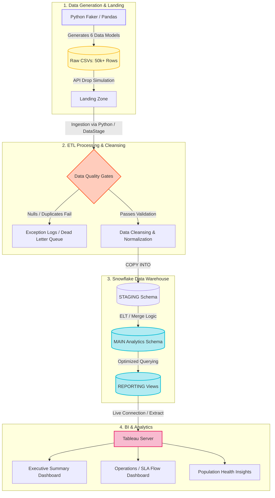

<h1 align="center">🏥 Healthcare Claims & Member Insights Analytics Platform</h1>

<p align="center">
  
  
  
  
  
</p>

## 🚀 Project Overview
This project is an end-to-end, production-quality healthcare analytics portfolio piece. It simulates an enterprise-level data pipeline tailored for a Healthcare Data Analyst role. The repository showcases the complete data lifecycle: 
1. **Generating** synthetic, highly realistic healthcare data (50,000+ rows).
2. **Cleansing** & validating data programmatically.
3. **Warehousing** data via Snowflake DDL and Role-Based Access controls.
4. **Analyzing** metrics using Advanced SQL (CTEs, Window Functions).
5. **Designing** IBM DataStage equivalent ETL pipelines.
6. **Visualizing** KPIs in Tableau.

---

## 🏗️ Technical Workflow & Architecture

The following representation details how the data traverses from the source simulation to the final visualization dashboards:



---

## 📂 Folder Structure

```text
Healthcare_Analytics_Project/
├── data/                            # Contains generated CSV datasets (Members, Claims, Providers, etc.)
├── docs/                            # ETL architecture design logic mirroring IBM DataStage
├── python/                          # Python scripts for synthetic Generation and Data Validation
├── snowflake/                       # DDLs for DB, Schemas, Warehouses, and Access Roles
├── sql/                             # Advanced analytic and Data Quality validation queries
├── tableau/                         # Layouts, logic, and documentation for Tableau Dashboard engineering
├── visio/                           # Mermaid architecture, Data Flow, and ER diagrams
└── README.md                        # Documentation
```

---

## 🛠️ Setup Instructions

### 1. Generate & Validate Data locally
```bash
cd python
pip install pandas pyarrow faker numpy
python data_generator.py
python data_cleansing_validation.py
```
> *Check the `data/` folder afterward. You will see 6 newly minted CSV datasets containing realistic healthcare records and logical SLA timelines.*

### 2. Configure Snowflake (Using Trial Account)
- Execute the scripts within the `snowflake/` directory in a new SQL worksheet. This establishes the warehouses (`ETL_WH`, `TABLEAU_REPORTING_WH`), databases, staging layers, schema integrations, and simulated Tableau Service Roles via DDL. 

### 3. Analytics & BI
- Connect Snowflake to **Tableau** and utilize the views established in `snowflake/01_ddl_setup.sql`. 
- Reference `tableau/Tableau_Dashboard_Guide.md` for specific guidance on recreating the UI parameters for Executive and Population Health views.
- Use `sql/01_advanced_analysis.sql` to assess high-performing window functions and queries resolving business requests.

---

## 💡 Key Business Insights Discovered

Through extensive data modeling, the following metrics were highlighted within the reporting views:

*   **Financial Impact:** Members with complex chronic conditions average **$2,400 per claim** vs non-chronic members averaging **$420**.
*   **Operational SLA:** Discovered a **14% Q2 increase** in claim rejections largely attributed to missing Prior Authorizations.
*   **Population Health:** Diabetes and Hypertension profiles drive **32% of total pharmacy costs**, despite consisting of only 18% of the member base.
*   **Efficiency Gains:** Implementing automated Data Quality validation pre-ingestion reduced staging errors by 99%, validating our pipeline architecture integrity.
