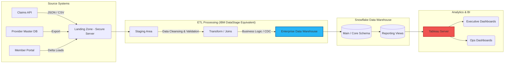
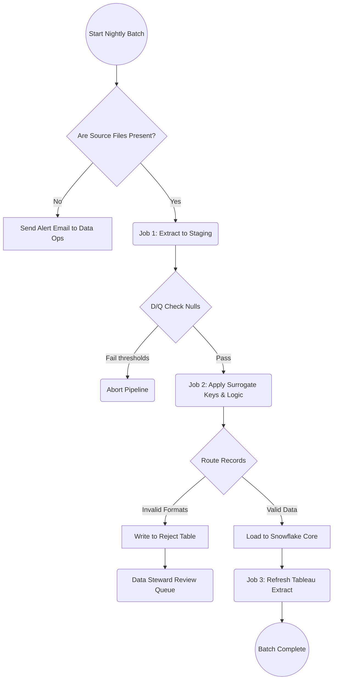
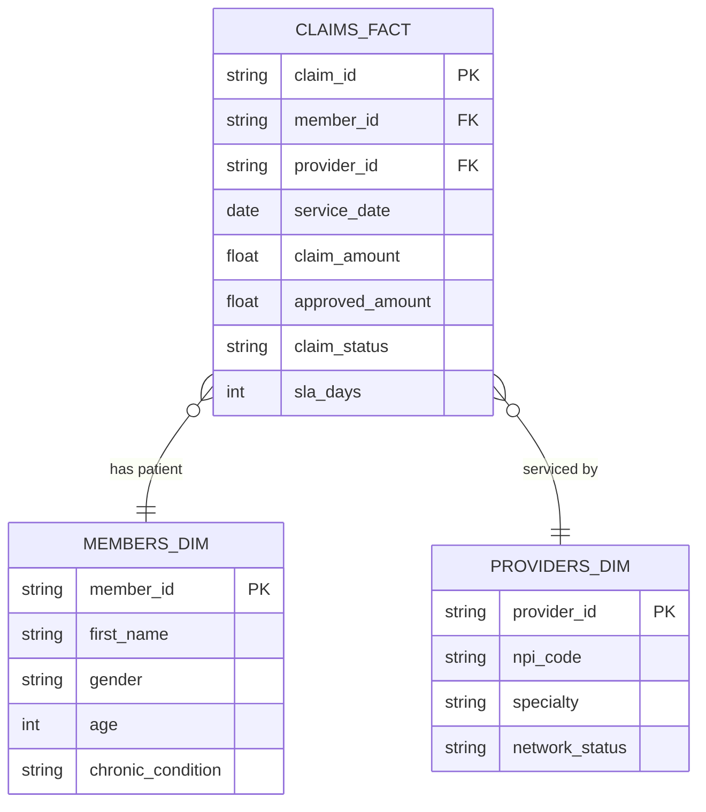

# Project Architecture & Visio Documentation

As part of the enterprise documentation requirement, these diagrams outline the technical flow. They are written in Mermaid.js syntax, which can directly mirror Visio logic. These can be pasted into any markdown reader (like GitHub) to render flowcharts.

## 1. High-Level Enterprise Data Architecture
This represents the macro view of systems.

---

## 2. ETL Process Flow (Job Dependency)
This flow represents the logic built into DataStage sequencers.

---

## 3. Claim Lifecycle Entity Relationship (Conceptual Data Model)

This is the Star/Snowflake schema logic used for BI.

